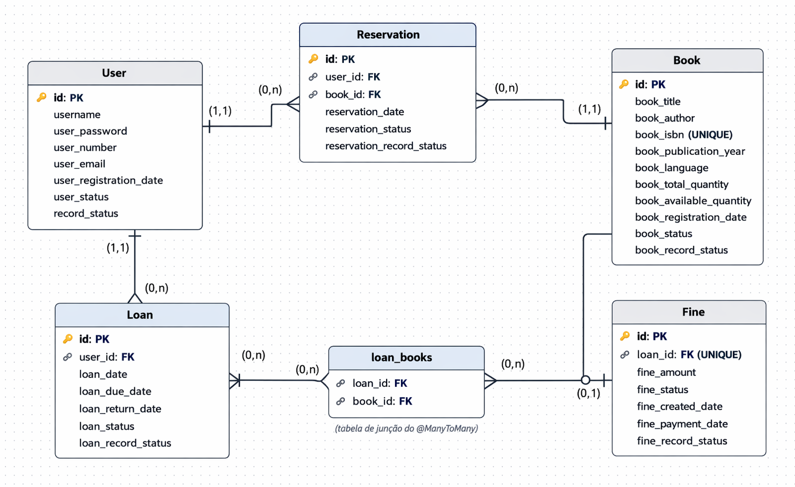
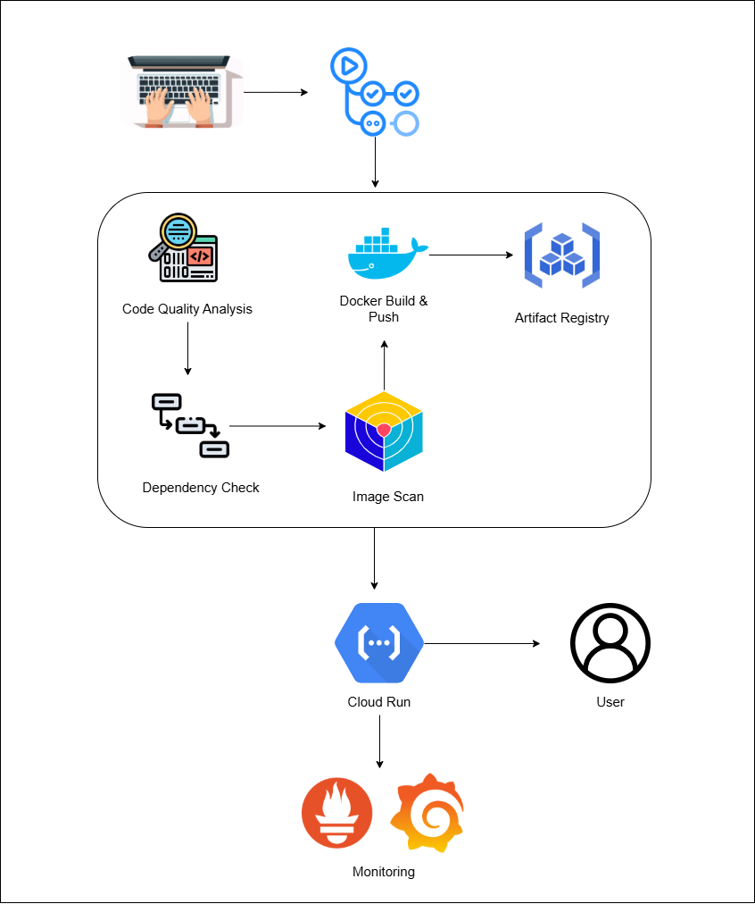

# Library Management System

## Overview
This project is a backend system for managing a library, handling users, books, loans, reservations, and fines.

The system is designed to ensure consistency in business rules, scalability in data relationships, and automation in deployment through a CI/CD pipeline.

---

## Business Rules
Some core rules implemented in the system:

* A book **cannot be reserved** if there is no available quantity
* A book **cannot be inactivated** if it still has available copies
* A loan must have at least **one book**
* A fine is generated when a loan is returned **after the due date**
* A user may have multiple loans, but rules can limit concurrency
* Reservations depend on book availability

---

## Architecture
The application follows a layered architecture:

* **Controller Layer** → Handles HTTP requests
* **Service Layer** → Contains business rules
* **Repository Layer** → Data persistence (JPA)
* **Entity Layer** → Database representation
* **DTO Layer** → Controls API input/output and avoids exposing entities
* **Mapper Layer** → Converts between entities and DTOs
* **Exception & Handler Layer** → Centralized error handling
* **Validation Layer** → Ensures input data integrity

The system also integrates with cloud infrastructure using containerization and automated pipelines.

---

## Entity-Relationship Diagram
The following diagram represents the database structure, including entities, relationships, and constraints:



### Key Design Decisions:
* A **User** can have multiple **Loans** and **Reservations**
* A **Loan** can contain multiple **Books** (Many-to-Many relationship)
* A **Fine** is uniquely associated with a **Loan**
* A **Book** tracks both total and available quantities
* `record_status` is used for **soft delete / logical control**

This structure ensures flexibility and supports real-world library operations.

---

## CI/CD Pipeline
The project uses an automated CI/CD pipeline to ensure quality, security, and continuous delivery.



### Pipeline Steps:
1. **Code Quality Analysis**

    * Static code analysis to maintain clean and standardized code

2. **Dependency Check**

    * Detects known vulnerabilities in dependencies

3. **Image Scan**

   * Performs security scanning on the container image

4. **Docker Build & Push**

    * Builds the application container
    * Pushes the image to Artifact Registry

5. **Deployment**

    * Deploys automatically to **Google Cloud Run**

6. **Monitoring**

    * Observability via logs and metrics

---

## Technologies
* Java 17+
* Spring Boot
* Spring MVC
* Spring Security
* Spring Data JPA
* Maven
* PostgreSQL
* Docker
* Google Cloud Run
* GitHub Actions (CI/CD)

---

## API Documentation
API endpoints are documented using Swagger.

Access:

```bash
http://localhost:8080/swagger-ui.html
```

---

## How to Run

### Clone the repository
```bash
git clone https://github.com/HeitorDalla/library-ops
cd library-ops
```

### Run with Docker
```bash
docker build -t library-ops .
docker run -p 8080:8080 library-ops
```

### Run locally
```bash
./mvnw spring-boot:run
```

---

## Project Structure

The project follows a layered architecture commonly used in Spring Boot
applications, separating concerns and improving maintainability.

```sh
library-ops/
├── .github/
│   ├── actions/
│   │   ├── cache-maven/
│   │   │   └── action.yml              # Reusable action for Maven dependency caching
│   │   └── upload-artifact/
│   │       └── action.yml              # Reusable action for build artifacts handling
│   └── workflows/
│       ├── build-java.yml              # Application build workflow
│       ├── test-java.yml               # Unit tests and quality checks
│       ├── scan-security.yml           # Trivy security scanning
│       ├── docker-publish.yml          # Docker build and push
│       └── main.yml                    # CI/CD pipeline orchestration
│
├── src/
│   └── main/
│       ├── java/
│       │   └── com/
│       │       └── heitor/
│       │           └── app/
│       │               ├── controller/        # REST controllers (API layer)
│       │               ├── dto/               # Data Transfer Objects
│       │               │   ├── input/          # Request payloads
│       │               │   ├── output/         # Response payloads
│       │               │   └── common/         # Shared DTO structures
│       │               ├── entity/             # JPA entities (domain model)
│       │               ├── enums/              # Domain enumerations
│       │               ├── exception/          # Custom application exceptions
│       │               ├── handler/            # Global exception handling
│       │               ├── mapper/             # Entity ↔ DTO mappers
│       │               ├── repository/         # Spring Data JPA repositories
│       │               └── service/            # Business logic layer
│       │                   └── impl/           # Service implementations
│       └── resources/
│          └── application.properties
│
├── Dockerfile
└── pom.xml
```

---

## Future Improvements
* Authentication with JWT
* Role-based access control (ADMIN / USER)
* Pagination and filtering for endpoints
* Notification system for due dates
* Caching layer (Redis)

---

## Author
Developed by **Heitor Villa**

---

## Contributing
I appreciate your contributions and efforts in improving this project! Please read the `CONTRIBUTING.md` file for details on the code of conduct and the process for submitting pull requests.

---

## License
This project is licensed under the MIT License – see the `LICENSE` file for details.
